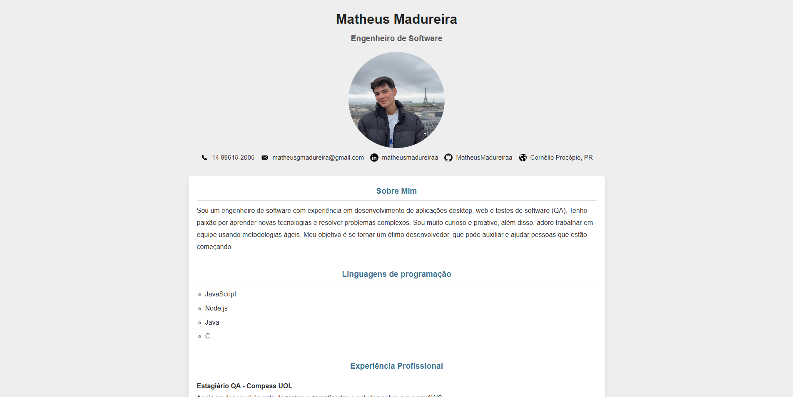
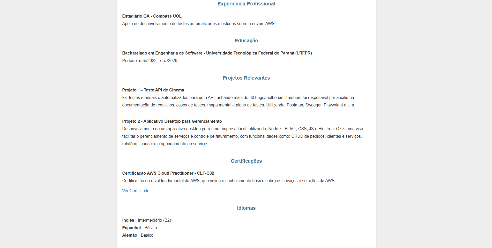
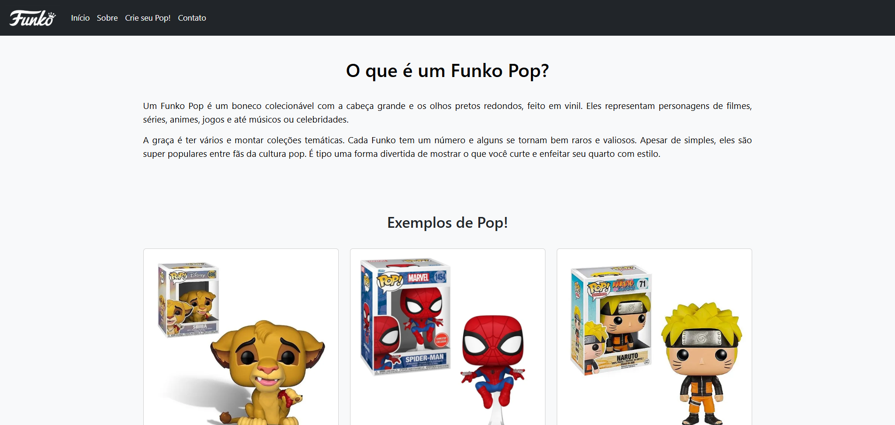
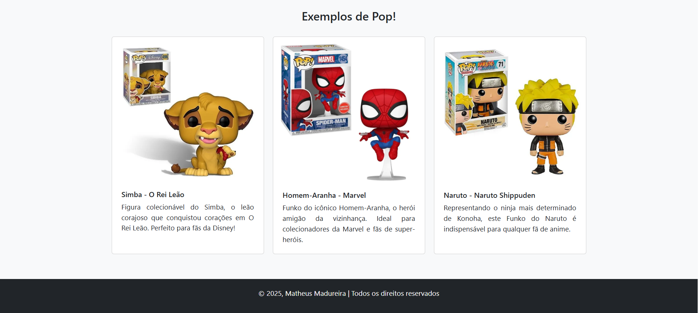

# CV com HTML

### 🛠️ Tecnologias Utilizadas
- **HTML5**  
- **CSS3**

### 📷 Imagem do site do CV

----

# Site Funko Pop - Projeto Front-End

### 🛠️ Tecnologias Utilizadas
- **HTML5**  
- **CSS3**  
- **[Bootstrap 5](https://getbootstrap.com/)** (para layout e responsividade)

### 📷 Imagens do site de Funko Pop!

### 💡 Funcionalidades
- Layout responsivo adaptado a celulares e desktops  
- Cards com descrição de Funkos populares (ex: Simba, Naruto, Homem-Aranha)  
- Menu e seções organizadas

#### 👨‍💻 Autor
Desenvolvido por **Matheus Madureira**  
