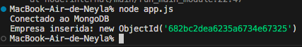

# MongoDB + Node.js - Inserção de daods

Aprendemos a inserir dados no banco de dados via Node.js



### Foram criadas as seguintes classes durante a atividade:
1. Empresa
2. Cliente
3. Produto
4. Pedido

### Como rodar:
Primeiramente, entre dentro da pasta **atividade06-mongoNode** quando clonar o repositório.

1. Rode o seguinte comando para conseguir testar:

```bash
    npm install mongodb
```

2. Em seguida, rode o app para cadastrar uma empresa:
```bash
    node app.js
```
